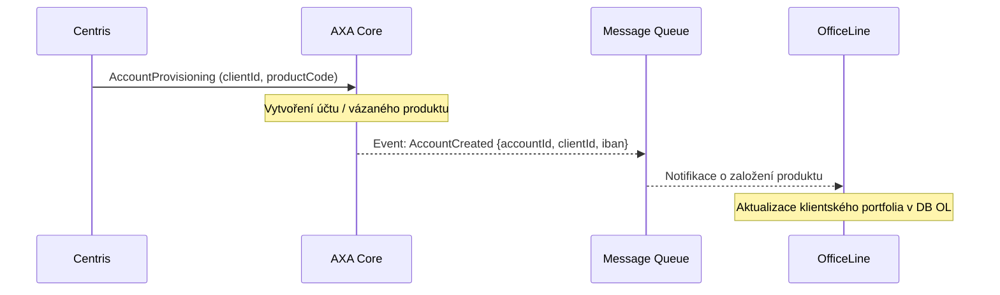

# AXA Integration – Technické sekvence a toky

Tento dokument detailně popisuje interakci se systémem AXA v klíčových procesech projektu.

## 1. Proces Onboardingu (Fáze: BACKGROUND_PROCESSING)

Asynchronní založení produktů pro nového klienta.

## 2. Proces Prodeje Cenných Papírů (Securities Trading)

Interakce během autorizace a vypořádání nákupu dluhopisu.

### Fáze 1: Ověření a Rezervace (Synchronní)
Probíhá v okamžiku, kdy klient v mobilní aplikaci autorizuje nákup.

1.  **OfficeLine** volá AXA pro ověření zůstatku (`VerifyBalance`).
2.  Pokud je zůstatek dostatečný, **OfficeLine** volá AXA pro vytvoření blokace (`ReserveFunds`).
3.  **AXA** potvrdí blokaci.

### Fáze 2: Vypořádání (Settlement - Asynchronní)
Probíhá po úspěšném zpracování obchodu v systému Centris.

1.  **Centris** potvrdí realizaci obchodu.
2.  **OfficeLine** (nebo asynchronní job) volá AXA k odepsání blokované částky (`CommitPayment`).
3.  **AXA** provede zúčtování a uvolní blokaci.

## 3. Klíčové parametry a pole
Při komunikaci s AXA jsou využívána následující klíčová pole:

*   **IBAN / Account Number:** Jednoznačná identifikace účtu v rámci clearingu.
*   **Balance Type:** Rozlišování mezi účetním zůstatkem a disponibilním zůstatkem (Available Balance).
*   **Blockage ID:** Identifikátor finanční rezervace pro pozdější spárování s platbou.
*   **Currency:** Měna operace (typicky EUR).

## 4. Chybové stavy a Rollback
*   **Nedostatek prostředků:** AXA vrací specifický kód chyby, který OfficeLine interpretuje do mobilní aplikace jako "Nedostatečný zůstatek".
*   **Timeout při blokaci:** Pokud AXA neodpoví včas, OfficeLine nesmí pokračovat v odesílání pokynu do Centrisu.
*   **Neúspěšný settlement:** Pokud obchod v Centrisu selže, OfficeLine musí v AXA vyvolat zrušení blokace (`CancelReservation`).

## 5. Monitoring (Hypercare)
Pro zajištění integrity dat po cutoveru jsou transakce v AXA monitorovány v reálném čase přes Elastic (Correlation ID) a denně odsouhlasovány proti stavům v Centrisu.

*Více v: [AXA Monitoring & Hypercare Strategie](AXA_Monitoring_Hypercare.md)*

---
*Zdroj: DigitalnyOnBoarding Wiki (TR-OL-CP-Celkova-architektura.md, TR-OL-ONB-krok-BACKGROUND_PROCESSING.md)*
