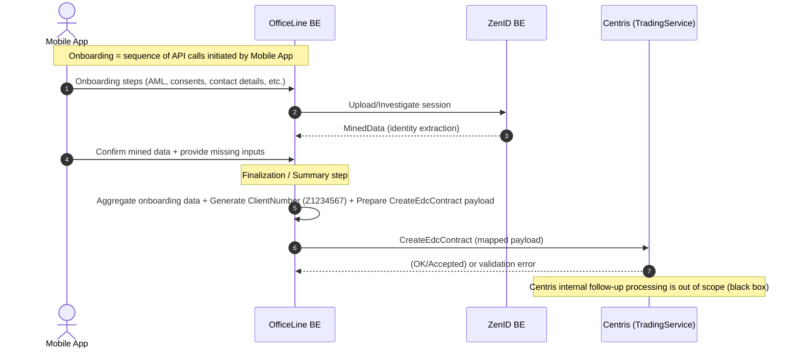

# Integrace CENTRIS – Technický přehled

Tento dokument popisuje technickou integraci mezi **OfficeLine BE** a **Centris (TradingService)** pro operace `CreateEdcContract` a související investiční služby.

## 1. Rozhraní a odpovědnosti

### OfficeLine BE
OfficeLine:
*   Agreguje data získaná během onboardingu (ZenID, vstupy od klienta).
*   Generuje `ClientNumber` ve formátu **Z + 7 náhodných číslic**.
*   Sestavuje payload `CreateEdcContract` dle mapovací specifikace.
*   Volá službu Centris (TradingService).

### Centris (TradingService)
Centris:
*   Přijímá payload `CreateEdcContract`.
*   Provádí validaci vstupu.
*   Vrací technickou odpověď (úspěch / validační chyba).
*   Interní zpracování v Centris (např. synchronizace do systému IBIS) je mimo rozsah této dokumentace.

## 2. Mapování dat a původ

Data odesílaná do Centris mohou pocházet z:
*   **ZenID (MinedData):** Vytěžená data z dokladů totožnosti.
*   **Vstupy z onboardingu:** Data zadaná klientem v mobilní aplikaci.
*   **Hodnoty generované v OfficeLine:** Např. `ClientNumber`.
*   **Odvozené nebo konstantní hodnoty:** Např. `BirthCountryCode` (pokud chybí, plní se konstantou).

## 3. Technický model komunikace

*   OfficeLine volá operaci `CreateEdcContract` synchronně.
*   Komunikace je typu **Request–Response**.
*   Centris vrací technickou odpověď (úspěch / validační chyba).

### Sekvenční diagram integrace

## 4. Otevřené technické body

*   **Formát času podpisu:** Používá se `dateTime` s časovou zónou (zvalidováno s BU).
*   **BirthCountryCode:** Pokud není k dispozici ze ZenID, plní se konstantou (řeší se s BU).
*   **CorrespondenceAddress:** Korespondenční adresa se aktuálně neposílá, Centris využívá trvalou adresu ze ZenID.
*   **DeviceInfo:** Plánované rozšíření o metadata zařízení v budoucích verzích.
*   **Ošetření chyb:** Asynchronní proces na úrovni založení produktu pro zajištění plynulosti onboardingu (řešení welcome mailu a nočních uživatelů).

---
*Zdroj: DigitalnyOnBoarding Wiki (Funkční specifikace OfficeLine / Architektura OL / Volaná rozhraní / CENTRIS.md)*
