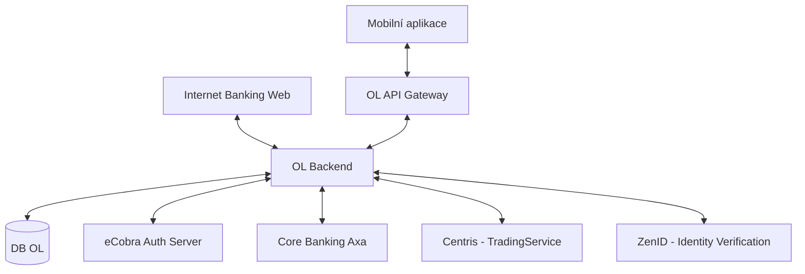

# Architektura OfficeLine (OL) a integrace

Tento dokument popisuje technickou architekturu a vazby systému **OfficeLine** v rámci řešení digitálního onboardingu a mobilního bankovnictví.

## 1. Komponentní pohled a datové toky

Centrálním prvkem řešení je **OL Backend**, který propojuje frontendové kanály (Mobile App, Web IB) s bankovním jádrem a externími partnery.

### Schéma integrací

## 2. Klíčové technické moduly

### OL API Gateway (REST INV API)
*   **Role:** Proxy vrstva, která publikuje REST API pro mobilní aplikaci.
*   **Funkce:** Mapování JSON požadavků na interní SOAP služby (např. Centris), validace tokenů, logging, monitoring a **Deferred DeepLink matching** (pro QR onboarding).
*   **Příklad mapování:** JSON POST `/v1/mifid/save` je na gatewayi transformován na SOAP `PerformClientExam`.

### DB OL (Databáze OfficeLine)
*   **Role:** Operační databáze systému.
*   **Uložená data:**
    *   **Stav transakcí:** Informace o probíhajících pokynech k cenným papírům (před synchronizací do IBIS).
    *   **Onboarding data:** Rozpracované žádosti o založení klienta.
    *   **Nabídka CP:** Cache aktuální nabídky cenných papírů získané ze systému Centris (zrcadlení bez historizace).

### eCobra Server (Autentizace)
*   **Role:** Zajišťuje silnou autentizaci uživatelů.
*   **Protokoly:** OpenID Connect (OIDC) / OAuth 2.0 (předpokládané dle specifikace mobilní aplikace).
*   **Bezpečnost:** Generování a validace autorizačních kódů pro operace vyžadující potvrzení PINem nebo biometrikou.

## 3. Integrační rozhraní (Volaná i poskytovaná)

| Partner / Systém | Protokol | Typ operací |
|---|---|---|
| **Axa Core Banking** | SOAP | Transakce, správa účtů, clearing. |
| **Centris** | SOAP (WS-Security) | Investiční smlouvy, pokyny CP, MiFID dotazníky. |
| **ZenID** | REST | Vytěžování dat z dokladů totožnosti. |
| **Mobilní aplikace** | REST (JSON) | Onboarding, prohlížení produktů, obchodování. |

---
*Zdroj: DigitalnyOnBoarding Wiki (Architektura OL, TR-OL-CP-Celkova-architektura.md)*
