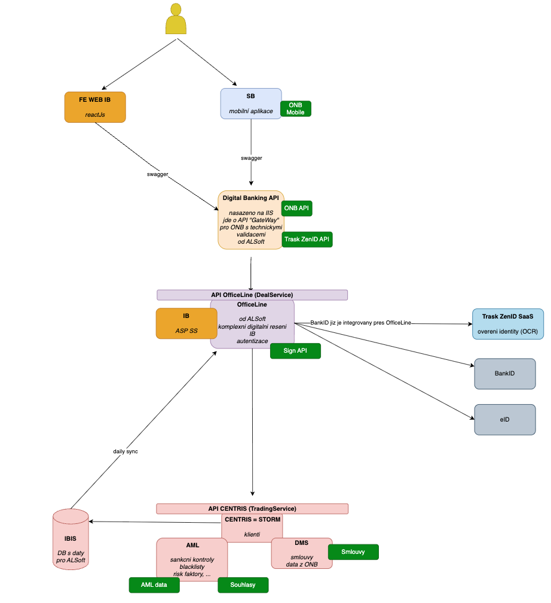
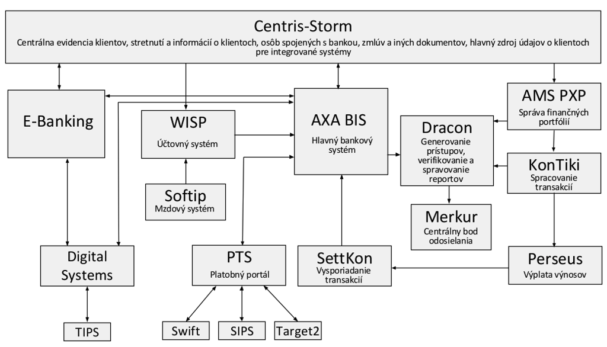

# Onboarding Architecture Blueprint

Tento dokument popisuje současné komponenty relevantní pro **onboarding**, jejich role a způsob vzájemné komunikace.

_Zakladní flow pro plnohodnotný onboarding proces:_
1. Identifikace klienta (faceID aka KYC skrze ZenID)
  - náběr údajů z ID a liveness => + validace do registr
  - ❌ Slovenský občan nemůže použít slovenskou identitu jako BankID v ČR
  - ❌ BankID není automaticky přeshraniční identita
  - :ok: ZenID
    
2. AML / sankční kontroly
    
3. Smluvní dokumentace
    
4. Elektronický podpis
    
5. Založení klienta v core systému
    
6. Aktivace účtu

## Zdroje
1. [Figma onboardingu](https://www.figma.com/design/GBRsstOiURYZ6Z6uHHOsfQ/Onboarding?node-id=0-1&p=f&t=aoKpzf9picNkCkcZ-0) - zachycuje celé flow procesu, jednotlivé obrazovky a ovládání klientem
2. [ZenID API](https://privatbanka.frauds.zenid.cz/swagger/index.html) (Swagger) - API Trask ZenID řešení, které zajišťuje KYC
  * [ZenID integrace](./ZenID_Integration.md) - popisuje způsob integrace a zapojení do onboardingu
3. [Figma Dashboard](https://www.figma.com/design/1hYsiMfxGKAGJaeFpyAsFY/Dashboard?node-id=0-1&p=f&t=fPQh6NXrQBa83K7K-0) - zachycuje podobu dashboardu pro webové bankovnictví.

# Prostředí

## DEV

1. **mobilní API backend** - [https://ma-dev.privatbanka.sk/api](https://ma-dev.privatbanka.sk/api "https://ma-dev.privatbanka.sk/api")
2. **nové IB** - [https://ibankdev.privatbanka.sk/PentaIB/](https://ibankdevpenta.privatbanka.sk/cs/smartbanking/dashboard "https://ibankdevpenta.privatbanka.sk/cs/smartbanking/dashboard")
3. **ZenID** - [https://privatbanka.frauds.zenid.cz/](https://privatbanka.frauds.zenid.cz/ "https://privatbanka.frauds.zenid.cz/")

## Architektura (schéma)

## Komponenty

### Centris / STORM
Evidence klientů a smluv.

- evidence klientů  
- evidence smluvních vztahů  
- zdroj pravdy pro základní klientská data  
- poskytuje informace potřebné pro onboarding (existence klienta, smluvní vztahy)

**Role v onboardingu**
- poskytuje základní klientská data  
- uchovává smlouvy a jejich stav  
- slouží jako backendový systém pro validaci údajů

---

### OfficeLine / Digitální platforma (BusinessLogic) / IB konzole
Plnohodnotné digitální řešení od ALSoft.

- provoz IB v režimu 24/7  
- zajištění okamžitých plateb  
- potvrzování zůstatků pro karetní operace  
- integrace se SIA pro karetní transakce  
- integrace s Trading Service pro investiční služby  
- poskytuje autentizační server (součást starého IB)  
  - autentizace uživatelů  
  - podepisování transakcí  
  - správa uživatelských session

**Role v onboardingu**
- poskytuje autentizační služby  
- uchovává informaci o ověření identity  
- zajišťuje procesy vyžadující silnou autentizaci  
- může být zdrojem dat potvrzených klientem
- eviduje kompletní flow **onboarding** procesu

---

### AML systém
Systém pro kontrolu rizikovosti klientů.

- sankční kontroly (externí registry sankčních seznamů)  
- interní blacklisty AML oddělení  
- vyhodnocování rizikových faktorů  
- poskytuje API pro AML kontrolu

**Role v onboardingu**
- validace klienta z pohledu regulatorních požadavků  
- rozhodnutí, zda může onboarding pokračovat  
- poskytuje výsledek AML kontroly (OK / rizikový klient / manuální review)
- **je součástí CENTRIS**

---

### Trask ZenID
Systém pro biometrickou identifikaci a verifikaci klientů.

- FaceID / liveness detection  
- extrakce a validace dokladů  
- ověření identity klienta

**Role v onboardingu**
- zajišťuje digitální identifikaci klienta  
- poskytuje data o ověření identity  
- vrací extrahované údaje z dokladů, které klient následně potvrzuje

---

### SB – SmartBanka
Mobilní aplikace banky.

- nativní aplikace (iOS, Android)  
- využívá SKD (Security Key Device) pro autentizaci, zabezpečení a kryptografii  
- poskytuje mobilní přístup k bankovním službám

**Role v onboardingu**
- může být využita jako autentizační prostředek  
- může sloužit jako kanál pro potvrzení identity nebo smluv  
- může být zapojena do bezpečnostních kroků

---

## Role jednotlivých entit v onboardingovém procesu

### Klient
- poskytuje osobní údaje  
- provádí identifikaci (např. přes ZenID)  
- potvrzuje správnost údajů  
- uzavírá smlouvu

### Smlouva
- reprezentuje právní vztah mezi klientem a bankou  
- je evidována v Centris/STORM  
- její stav ovlivňuje průběh onboardingu (např. čeká na AML, čeká na podpis)

### Ověření identity
- probíhá prostřednictvím ZenID nebo jiného mechanismu  
- výsledkem je sada ověřených údajů  
- údaje jsou následně potvrzeny klientem  
- **OfficeLine** může uchovávat informaci o tom, že identita byla ověřena

---

## Komunikace mezi komponentami

### Centris/STORM ↔ OfficeLine
- výměna informací o klientech a smlouvách  
- **OfficeLine** využívá data z Centris jako zdroj pravdy  
- změny provedené během onboardingu se propisují zpět do Centris

### OfficeLine ↔ Centris (AML)
- OfficeLine volá AML API pro provedení sankčních a rizikových kontrol  
- AML vrací výsledek kontroly (OK / rizikový klient / manuální review)

### OfficeLine ↔ ZenID
- OfficeLine iniciuje proces identifikace  
- ZenID vrací biometrická data, výsledek verifikace a extrahované údaje z dokladů

### SmartBanka ↔ OfficeLine
- SmartBanka může sloužit jako autentizační kanál  
- OfficeLine využívá SKD pro bezpečné operace  
- může být využita pro potvrzení kroků v onboardingu

---

# Figma Breakdown

[Figma onboardingu](https://www.figma.com/design/GBRsstOiURYZ6Z6uHHOsfQ/Onboarding?node-id=0-1&p=f&t=aoKpzf9picNkCkcZ-0) - zachycuje celé flow procesu, jednotlivé obrazovky a ovládání klientem

---

## Intro Obrazovka ✅
- **ID procesu / session** — nutné pro detekci duplicit, navázání, troubleshooting

---

## Kontaktní údaje ⚠️
### SMS ověření
- SMS brána, integrace, validace
- **eKobra** od OfficeLine (poplatky, čísla…)
- backend kontrola timeoutu, aby nedošlo ke zneužití

### E‑mail ověření
- validace e‑mailu, ověření, že jsme jeho vlastníkem (typo check)
- backend endpoint pro odeslání e‑mailu
- ping, že e‑mail existuje / je správný

---

## Souhlas: biometrika ⚠️
- uložení souhlasu v DB
- GDPR

---

## Ověření identity / Liveness ⚠️
### ZenID
- viz [ZenID integrace](./ZenID_Integration.md)

### Extrakce dat (OCR)

### API pro uložení dat z OCR / potvrzených klientem

---

## AML ⚠️
- PEP ukončuje proces ⚠️💥

---

## Máte téměř hotovo ⚠️
### Smlouvy

---

## Podpis pomocí SMS ⚠️
- podepisujeme a generujeme skrze OfficeLine, výsledek ukládáme do CENTRIS

---

## Registrace do Mobil Banky

---

## Regulační prohlášení

---

## Klient má vytvořen běžný účet
