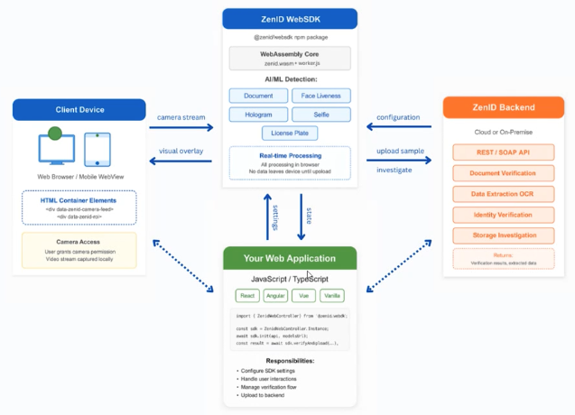
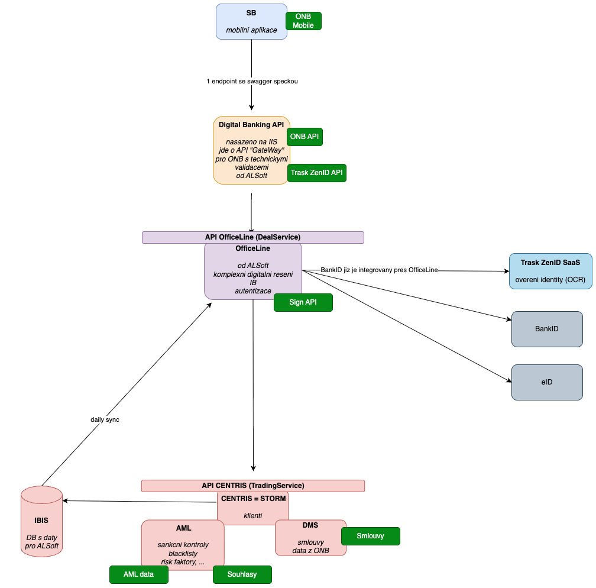
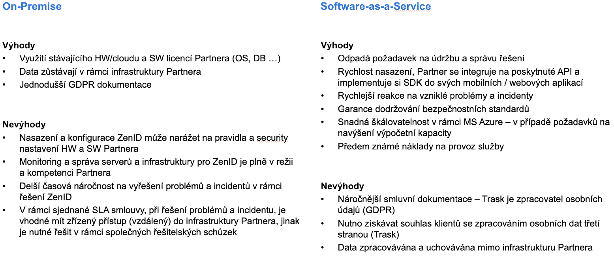

# Trask ZenID Integration

**Trask ZenID** je produkt společnosti [Trask](https://www.thetrask.com/cs-cz/en/product/trask-zenid) určený pro automatizovanou identifikaci klientů (KYC), ověřování dokladů a biometrickou verifikaci obličeje (face verification).  
Využívá OCR, NFC a pokročilé biometrické moduly pro spolehlivou online verifikaci, typicky využívanou v bankovnictví a pojišťovnictví.

---

# Využití v Mobilním Onboardingu

ZenID je využíván v rámci **Mobilního Onboarding procesu**, kde zajišťuje:

- identifikaci klienta prostřednictvím občanského průkazu,
- ověření pravosti dokladu,
- liveness / face verification.

Používáme **SaaS verzi** produktu hostovanou v prostředí **Microsoft Azure**, poskytovanou formou služby.

---

# Logický diagram zodpovědnosti
Kapitola popisuje zodpovědnosti mezi **ZenID backend**, **mobilní aplikací** a **ZenID SDK**.

# Architektura

Z pohledu bezpečnosti, flexibility, observability mobilní zařízení nevolá ZenID napřímo, ale skrze API Gateway, který má síťový prostup na ZenID.

Je nutné proxovat následující operace:
1. **`GET api/initSdk`**  
2. **`POST api/sample`**
3. **`GET api/investigateSample`**

---
# Infrastruktura

## Síťová a aplikační vrstva
- Součástí řešení je **Microsoft Application Gateway**, která zároveň funguje jako **WAF**.

## Prostředí (test / prod)
- Testovací prostředí **duplikuje produkční** (DB, aplikační služby).
- Je možné vytvořit **sandbox** prostředí (za příplatek).
- Testovacích instancí může být více (DEV, SIT, UAT…).
- V tuto chvíli postačí Sandbox.

## Tracing a identifikace
- API podporuje `customData` (ve swaggeru), kam lze doplnit:
  - correlation ID,
  - processId (doporučeno).
  - v našem případě se jedará o objekt JSON pro flexibilitu

# Přístupová práva
- Backend konzole má předdefinované role pro:
  - přístup k logům,
  - auditním logům,
  - administraci,
  - nelze zde využít SSO.

 

# Deployment

:warning: V tuto chvíli řešíme SaaS deployment na infrastruktuře Azure.

---

## Demo / Sandbox prostředí

**URL:**  
https://privatbanka.frauds.zenid.cz/

### Obsah demo prostředí

- **Manuál:**  
  https://privatbanka.frauds.zenid.cz/Manual  
  - SDK: https://privatbanka.frauds.zenid.cz/Manual/SDK  
  - iOS SDK: https://privatbanka.frauds.zenid.cz/Manual/SdkIOS  
  - Android SDK: https://privatbanka.frauds.zenid.cz/Manual/SdkAndroid  
  - API: https://privatbanka.frauds.zenid.cz/Manual/API

- **Swagger:**  
  https://privatbanka.frauds.zenid.cz/swagger/index.html

- **WebSDK Demo:**  
  https://privatbanka.frauds.zenid.cz/WebSDKDemo/

---

# Implementační detaily

## Základní workflow

1. **`GET api/initSdk`**  
   - inicializace SDK, autentizace
   - řeší SDK v mobilním zařízení (součást knihoven produktu)

2. **`POST api/sample`**  
   - odeslání souboru (v našem případě 3×: OP front, OP back, liveness). 
     - `uploadSessionID` - **SessionID** je GUID vytvořené klientem pro seskupení více nahraných vzorků.
     - `customData:{"processId: ""}` - JSON objekt
     - `async:true` 
     - `profile: mobile`
     - pozn.: SDK **nevolá backendové služby samo**, pouze naznačuje, kde je volat.
   - z odpovědi ukládáme `SampleID` pro další volání

3. **`GET api/investigateSample`**  
   - vyhodnocení dat.  
   - lze volat:
     - podle `sessionId`, nebo
     - podle seznamu referencí jednotlivých samplů (`SampleID`).
   - kontrola, že `State` je `Done`

## Asynchronní volání
- API podporuje `async` parametr.
- Doporučení:
  - nahrávání dokumentů → **asynchronně**,  
  - `investigateSample` → **synchronně** (trvá typicky 3–5 sekund).

---

## Auditní výstupy

ZenID umožňuje generovat **PDF s vytěženými daty**, které lze:

- archivovat,
- orazítkovat,
- využít pro auditní účely.

---

# Doporučení pro UX a Validace

## Potvrzovací obrazovka po naskenování dokladu
Doporučuje se zobrazit uživateli obrazovku s náhledem naskenovaných dat:

- uživatel vidí, co bylo vyčteno,
- může potvrdit správnost,
- může zvolit „naskenovat znovu“.

## OCR validace
- OCR kontroluje QR kód a kontrolní číslici („osmičku“) na konci čísla dokladu.
- Po odeslání probíhá **OCR validace na backendu** (dle confidence score).
- V případě nízké confidence je vhodné vyžádat opakované naskenování.

---

## Dostupné osobní údaje

Po vyčtení dokladu jsou dostupné **všechny údaje z občanského průkazu**, s výjimkou:

- podpisu držitele,
- kódu držitele.

### Poznámky:
- **Adresa může být prázdná** → je nutné s tím počítat.  
- **Adresa může být velmi dlouhá** (např. u osob bez trvalého bydliště – adresa úřadu).  
- **PSČ se doplňuje z RUIAN** → závisí na úspěšném nalezení adresy v registru.

---

# Předpoklady zahájení vývoje

- nutné získat **sandbox** - :white_check_mark:,
- mobilní vývojáři se musí seznámit se SDK - :white_check_mark:
